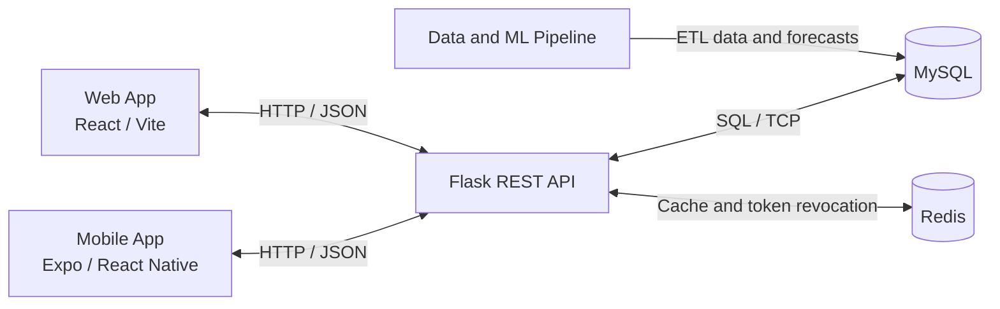

# ClearPath

**UCD COMP47360 Research Practicum — Team 6**

ClearPath is an accessibility-intelligence application that helps visitors find suitable healthcare and essential services in Manhattan.

## Project Management Workspace

### [Open the ClearPath Notion Workspace](https://app.notion.com/p/Summer-Project-Group-6-365cdfe1a8f680e7802cecb59cc4c1d0?source=copy_link)

The workspace contains:

- Project Backlog
- Sprint Backlogs
- Weekly Meeting Records
- Daily Budget Progress
- Tracking Tables and Burndown Charts

---

## Overview

ClearPath combines:

- a React and Vite web application;
- an Expo and React Native mobile application;
- a Flask REST API;
- MySQL and Redis services; and
- a Data and Machine Learning pipeline.

The system supports venue discovery, accessibility and language filtering, community reporting, busyness forecasting, route planning, multilingual assistance and emergency-support workflows.

---

## Project Resources

| Resource | Description |
| --- | --- |
| [Project Documentation](docs/README.md) | Requirements, mockups, testing evidence, demo videos and technical documents. |
| [Budget and Timesheets](docs/budget_and_timesheets/) | Combined budget and timesheet records for Sprints 1–5. |
| [OpenAPI Specification](openapi.yaml) | Shared REST API contract for the Web, Mobile and Backend components. |
| [Data and ML Documentation](Data+ML/README.md) | Data sources, ETL processing, database preparation and forecasting instructions. |

---

## Repository Structure

| Area | Location | Purpose |
| --- | --- | --- |
| Web application | [`frontend/web`](frontend/web) | React and Vite dashboard, including the live map, venue details, routing and Insights Dashboard. |
| Mobile application | [`frontend/mobile`](frontend/mobile) | Expo and React Native client, including onboarding, map, reporting, routing, Show Staff and SOS workflows. |
| Backend API | [`backend`](backend) | Flask API, authentication, venue, reporting, routing, busyness and insights services. |
| Data and Machine Learning | [`Data+ML`](Data+ML) | Source data, ETL scripts, database preparation and busyness forecasting. |
| Database | [`docker/mysql`](docker/mysql) | MySQL schemas, migrations, seed scripts and database utilities. |
| Documentation | [`docs`](docs) | Project records, technical documents, testing evidence, budgets and timesheets. |
| CI/CD | [`.github/workflows`](.github/workflows) | Backend, Data/ML, Web, Mobile and EC2 deployment workflows. |
| Local services | [`docker-compose.yml`](docker-compose.yml) | MySQL, Redis, phpMyAdmin and optional telemetry services. |
| API contract | [`openapi.yaml`](openapi.yaml) | Endpoint, request and response definitions shared across the system. |

---

## System Architecture

The Web and Mobile clients communicate with the Flask API through HTTP and JSON.

The API reads application data and forecast outputs from MySQL and uses Redis for caching and token revocation. The Data and ML pipeline prepares venue data, telemetry records and busyness forecasts.



---

## Quick Start

### Prerequisites

- Docker Desktop with Docker Compose
- Node.js 20 or later
- npm
- Python 3.11 or later
- Poetry

### 1. Clone the Repository

```bash
git clone https://github.com/ChingYunHsu/Group6_Summer-Project.git
cd Group6_Summer-Project
```

### 2. Start MySQL, Redis and phpMyAdmin

```bash
docker compose up -d mysql redis phpmyadmin
```

The local services are available at:

| Service | Address |
| --- | --- |
| MySQL | `localhost:3306` |
| Redis | `localhost:6379` |
| phpMyAdmin | `http://localhost:8080` |

MySQL schemas and seed scripts are loaded from:

```text
docker/mysql/init
```

### 3. Start the Backend API

Create `backend/.env` from `backend/.env.example`, then run:

```bash
cd backend
poetry install --no-interaction --no-root --sync
poetry run python src/main.py
```

The API runs at:

```text
http://localhost:5000
```

External services such as Google Maps and Gemini require valid credentials in `backend/.env`.

### 4. Start the Web Application

Open a second terminal:

```bash
cd frontend/web
npm ci
npm run dev
```

### 5. Start the Mobile Application

```bash
cd frontend/mobile
npm ci
npm start
```

The mobile client can be opened with Expo Go, an Android emulator or an iOS simulator.

Platform-specific commands are also available:

```bash
npm run android
npm run ios
```

---

## Testing and Build Checks

Run the relevant checks before merging changes into `main`.

### Backend

```bash
cd backend
poetry run pytest tests/ -m "not integration"
```

### Web

```bash
cd frontend/web
npm run lint
npm test
npm run build
```

### Mobile

```bash
cd frontend/mobile
npm run lint
npm test
```

Testing plans, user-testing scripts, results and supporting evidence are indexed in [docs/README.md](docs/README.md).

---

## Data and Machine Learning

Data sources, ETL scripts, database-loading utilities and forecast instructions are documented in the [Data and ML README](Data+ML/README.md).

---

## Optional Telemetry Service

Live telemetry is disabled by default and requires approved provider credentials.

It can be enabled with:

```bash
docker compose --profile telemetry up -d
```

---

## CI/CD

GitHub Actions provides separate workflows for:

- Backend CI
- Data and ML CI
- Web CI
- Mobile CI
- AWS EC2 deployment

Workflow definitions are stored in [`.github/workflows`](.github/workflows).

The `main` branch is protected. Pull Requests must pass the required status checks before merging.

---

## Security

Do not commit:

- `.env` files;
- passwords or access tokens;
- Google Maps, Gemini or AWS credentials;
- identifiable participant information;
- non-anonymised testing responses;
- real medical information; or
- production database backups.

All publicly shared user-testing materials must be anonymised.
