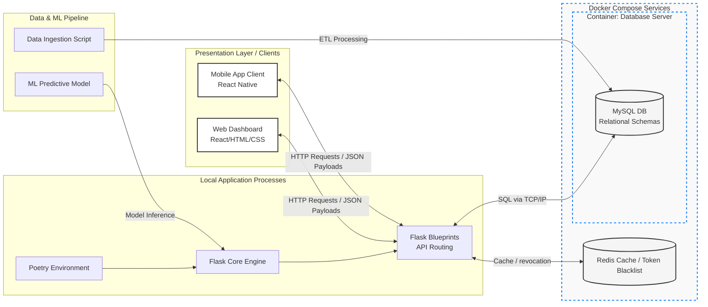

# Group6_Summer-Project
UCD COMP47360 Team 6 — **ClearPath**, an accessibility intelligence application for Manhattan. It combines a React web dashboard, an Expo mobile client, a Flask API, MySQL/Redis services, and an offline Data/ML pipeline.

## For assessors: what is in this repository

| Area | Location | Purpose |
| --- | --- | --- |
| Web application | [`frontend/web`](frontend/web) | React + Vite dashboard, including the live map and insights views. |
| Mobile application | [`frontend/mobile`](frontend/mobile) | Expo / React Native mobile client. |
| API | [`backend`](backend) | Flask blueprints, authentication, reporting, routes, venue and insights APIs. |
| Database and infrastructure | [`docker`](docker), [`docker-compose.yml`](docker-compose.yml) | MySQL schema/seed scripts; local MySQL, Redis and phpMyAdmin services. |
| Data and ML | [`Data+ML`](Data+ML) | ETL, telemetry, forecasting experiments and data documentation. |
| API contract | [`openapi.yaml`](openapi.yaml) | Shared REST API specification. |
| Technical documentation | [`docs`](docs) | ERD, telemetry contract and exported-venue schema. |

## Architecture

The browser and mobile applications communicate with the Flask API over HTTP/JSON. The API reads from MySQL and uses Redis for short-lived caching and token revocation. Data/ML processes prepare the source data and forecast outputs consumed by the application.

### System Architecture Diagram



## Quick start: reproduce the local system

### Prerequisites

- Docker Desktop with Docker Compose
- Node.js 20+ and npm
- Python 3.11+ and Poetry

### 1. Start the database services

From the repository root:

```bash
docker compose up -d mysql redis phpmyadmin
```

MySQL is exposed on `localhost:3306`, Redis on `localhost:6379`, and phpMyAdmin at [http://localhost:8080](http://localhost:8080). The MySQL schema and seed scripts run from [`docker/mysql/init`](docker/mysql/init) on first startup.

### 2. Configure and start the API

```bash
cp backend/.env.example backend/.env
cd backend
poetry install --no-interaction --no-root --sync
poetry run python src/main.py
```

The Flask API listens on [http://localhost:5000](http://localhost:5000) by default. Replace placeholder values in `backend/.env` before using external services such as Google Maps or Gemini.

### 3. Start the web application

In a second terminal:

```bash
cd frontend/web
npm ci
npm run dev
```

Vite proxies `/api` calls to `http://127.0.0.1:5000` during local development.

### 4. Start the mobile application (optional)

```bash
cd frontend/mobile
npm ci
npm start
```

Use Expo Go, an emulator, or the platform-specific `npm run ios` / `npm run android` commands.

## Testing and build checks

```bash
# Backend
cd backend && poetry run pytest tests/ -m "not integration"

# Web
cd frontend/web && npm run lint && npm test && npm run build

# Mobile
cd frontend/mobile && npm run lint && npm test
```

The data/ML module has its own [README](Data+ML/README.md), including ETL and database setup information.

## Data and deployment notes

- Versioned input snapshots are stored in [`Data+ML/raw_data_source`](Data+ML/raw_data_source). Their processing and Manhattan record counts are documented in [Data+ML/README.md](Data+ML/README.md).
- The included Compose configuration is the reproducible local infrastructure deployment: MySQL, Redis and phpMyAdmin. The Flask API and Web client are started separately using the commands above.
- Live telemetry is deliberately opt-in. It requires approved provider credentials and configuration, then can be enabled with `docker compose --profile telemetry up -d`. See the [telemetry feed contract](docs/telemetry-feed-contract.md).
- This repository does not publish a public production URL or production secrets. Deployment evidence should use the local reproduction steps above and the API contract in [openapi.yaml](openapi.yaml).

## Contributor workflow

## 1. Git Branching & Pull Request (PR) Policy

The main branch is locked and reserved strictly for stable, production-ready code. No direct pushes to main are allowed.

### Branch Naming Convention
When working on a backlog task, create a separate feature branch using the following shortened prefix formats:

    feature/fe-mob-[task] (Mobile Front-End / React Native, e.g., feature/fe-mob-login)

    feature/fe-web-[task] (Web Front-End / Dashboard, e.g., feature/fe-web-charts)

    feature/be-[task]     (Back-End / Flask & Poetry, e.g., feature/be-clinic-api)

    feature/db-[task]     (Database & Data Processing, e.g., feature/db-nyc-scraping)

    bugfix/[issue]        (For resolving broken code or system crashes)

### Pull Request & Integration Workflow
Commit and push your work to your remote feature branch.

Open a Pull Request (PR) on GitHub targeting the main branch.

Link your PR to the corresponding Notion Backlog Task.

Peer Review & Conflict Handling:

* If there is a code conflict: Tag the teammate whose branch has the conflict to review and approve it within two days. Once they have approved, the Integration Lead (Ivy) will personally handle the merge.

* If there are no conflicts: You are free to merge your own PR once it’s ready, but please make sure to follow the chronological order in which the PRs were created to prevent any race conditions.

---

## 2. Code Quality & Unit Testing

To safeguard our MVP increment against unexpected crashes before project demonstrations, **all new feature implementations must include automated unit tests.**

* **Backend (Flask/Poetry):** Ensure all new RESTful API endpoints and data parsing functions have corresponding unit tests tracking status codes and expected JSON payloads. Run your tests locally via Poetry before submitting a PR.
* **Frontend (React Native):** Ensure core navigation routers and base UI helper utilities pass baseline component testing.
* **Pre-merge Check:** Do not approve or merge any PR if the local unit tests are failing.

---

## 3. Scrum Tracking & Sprint Logistics

Scrum Master will be actively monitoring repository health and metrics to update our **Notion Backlog** and **Excel Burn-Down Charts**.

* **Daily Updates:** Please report your completed tasks and actual work hours to Scrum Master daily (or within a 2-day buffer window). 
* **Completion Rate & Progress Tracking:** Your **Actual Working Hours** will be constantly cross-referenced with the **Estimated Time** allocated in the backlog. This ratio will serve as a key metric to reflect the true completeness and development velocity of each task.
* **Scope Variance Check:** If your actual work hours vary from the backlog estimate by more than 6 hours within 48 hours of the deadline or if the progress seems stuck, Scrum Master will check in with you to analyze potential scope creep, help unblock dependencies, and recalibrate our sprint estimation metrics.
