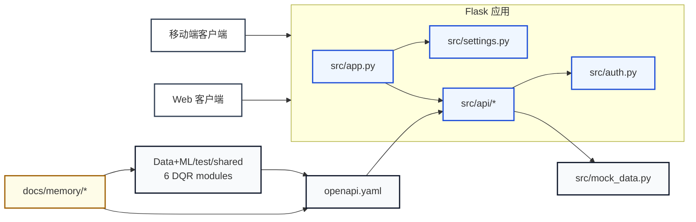

# ClearPath 项目架构总览

> 基于 `docs/memory/` 和当前源码树整理的架构摘要。
> 更新日期：2026-06-11

## 1. 系统是什么

ClearPath 是一个面向曼哈顿无障碍出行的应用，对外有三层可见面：

- 移动端客户端
- Web 客户端
- Flask API，供两个客户端和契约 / mock 数据流程共同使用

领域术语已固定在 [context-terms.md](context-terms.md) 中：

- `venue` 是核心 POI 记录
- `report` 记录无障碍事件
- `busyness` 跟踪实时和预测拥挤度
- `route` 提供出行方案和路线详情
- `user` 负责资料、收藏、设置和医疗数据
- `app-state` 记录客户端启动状态

## 2. 架构一览

## 3. 当前模块地图

### `src/app.py`

- 应用工厂
- 加载 `Settings`
- 注册所有 blueprint
- 对外暴露本地开发用 Flask app

### `src/settings.py`

- 读取环境变量
- 把配置收敛成一个 `Settings` 记录
- 把启动配置集中在一个地方

### `src/auth.py`

- 提供 `require_api_key`
- 作为当前大多数 API 路由的传输门禁
- 让认证行为保持浅且集中

### `src/api/*`

按领域分组的 blueprint：

- `health.py`
- `integrations.py`
- `user.py`
- `routes.py`
- `app_state.py`
- `venues.py`
- `reports.py`
- `insights.py`

每个 blueprint 基本都是从 `mock_data.py` 读取数据并返回 JSON。

### `src/mock_data.py`

这是当前 mock API 的共享 fixture 源。

它保存了：

- venue 数据
- report 数据
- route 数据
- dashboard / insights 数据
- app state
- user profile、settings、favourites、language options 和 medical data

这个文件是当前架构摩擦的主要来源，因为它把多个领域混在一个大模块里。

### `Data+ML/test/shared/`

DQR pipeline 的 6 个共享 Python 模块（2026-06-11 从 notebook 拆出）：

- `dqr_utils.py` — DB 连接、地理判断、坐标验证
- `dqr_io.py` — 数据加载、CSV 导出、审计报告
- `dqr_checks.py` — 7 项质量检查 + DQ 评分 + D2.7
- `dqr_analysis.py` — 列分析、异常检测、GPS 重复检测
- `dqr_cleaning.py` — 清洗管道（不修改输入 DataFrame）
- `external_ingestion.py` — 交通/天气外部数据获取

Notebook `dqr_cleaning_pipeline.ipynb` 仅保留编排 + 图表（21 cells, 218 lines）。pytest 覆盖 12 个测试用例。

### `openapi.yaml`

这是客户端和后端计划共同依赖的契约面。

它在若干地方比当前 mock 实现更完整，这在当前 sprint 阶段是可以预期的，但也带来漂移风险。

### `docs/memory/*`

这是跨会话的持久化记忆层。

- [project-status.md](project-status.md) 记录当前项目状态
- [project-issues.md](project-issues.md) 记录已知问题及严重级别
- [execution-plan.md](execution-plan.md) 记录构建计划
- [context-terms.md](context-terms.md) 固定领域词汇和决策
- [session-log.md](session-log.md) 记录持久化的分析笔记

## 4. 架构上已经成立的部分

- `src/app.py` 里有单一应用工厂
- `src/settings.py` 里有单一配置模块
- `src/auth.py` 里有单一认证 seam
- blueprint 按领域拆分，而不是挤在一个巨大的路由文件里
- `docs/memory/` 已经在承担仓库期望的持久化项目记忆职责

## 5. 目前仍然浅的地方

当前实现最关键的浅层点在这里：

- `src/mock_data.py` 是所有路由共享的单体实现细节
- route handler 基本只是围绕那份共享 fixture 状态做运输封装
- 契约和 fixture 的命名可能会漂移
- 有些问题本质是结构形状不一致，而不是功能缺失

**已深ening 的部分** (2026-06-11)：

- DQR pipeline 从单体 notebook 拆为 6 个共享模块，pytest 覆盖 D2.7

`project-issues.md` 里已经记录的例子包括：

- `confirmation_count` 和嵌套的 `confirmations.count`
- `emergencyasset` 和 `emergency_asset`
- 诸如 `MEDICAL_ID` / `EMERGENCY_CONTACTS` 之类缺失的 fixture 字段

## 6. 值得推进的深ening 方向

当前值得优先探索的候选有三个：

1. 把 `src/mock_data.py` 拆成按领域划分的 fixture 模块
   - 保持相同的传输面
   - 每个领域的数据进入自己的模块
   - 收益：更好的 locality、更小的修改面、更少的跨领域连锁破坏

2. 在 blueprints 后面引入一个共享的领域数据 seam
   - route handler 只保留 transport 职责
   - 领域数据访问下沉到一个内部模块
   - 收益：以后从 fixture 切到真实存储时，不必重写每条路由

3. 把契约和 fixture 的映射统一到一个地方
   - 用一个 adapter 做命名和结构转换
   - 收益：`openapi.yaml`、fixture、route response 之间的静默不一致会少很多

## 7. 最优先目标

DQR pipeline 已完成深ening（6 modules + pytest）。下一个该深ening 的地方是 `src/mock_data.py`。

原因：

- 它是最宽的共享实现细节
- 它带来的命名漂移最多
- 它把不同领域的 bug 集中到一起
- 删除它并不会让复杂度消失，只会把复杂度摊到更多调用方，这正说明它应该被拆，而不是继续放任

## 8. 架构建议

保留当前 Flask / blueprint 结构。

先把数据侧做深：

- 保留 `src/app.py`、`src/settings.py`、`src/auth.py` 作为稳定的小 seam
- 按领域拆分 fixture 所有权
- 把 `docs/memory/` 继续作为决策和后续事项的持久化记录

这样可以用最小的改动换到最大的 leverage。

