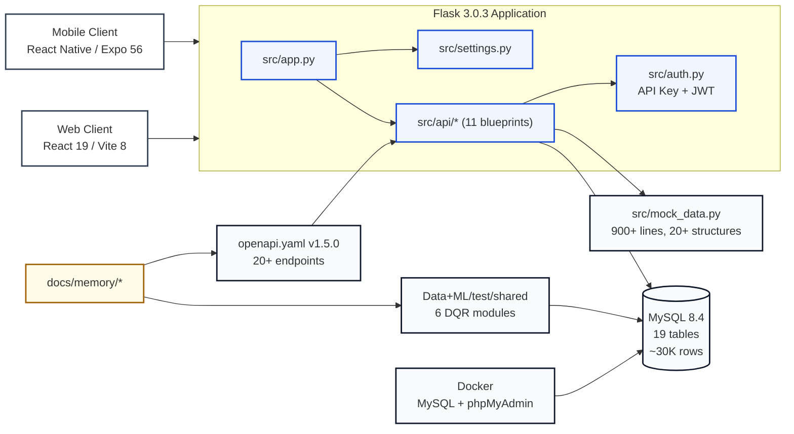

# ClearPath Architecture Overview

> Based on `docs/memory/` and the current source tree.
> Updated: 2026-06-12

## 1. What the System Is

ClearPath is a Waze-style accessibility navigation app for vulnerable tourists in Manhattan. It has three visible surfaces:

- **Mobile client** (React Native / Expo Router — 7 screens)
- **Web client** (React 19 / Vite — 8 routes)
- **Flask API** (11 blueprints, 20+ endpoints) serving both clients with mock data

Domain terminology is fixed in [context-terms.md](context-terms.md):

| Term | Meaning |
|------|---------|
| `venue` | Core POI record (24 columns: district, language, accessibility, weather_risk) |
| `report` | Crowd-sourced accessibility incident report |
| `busyness` | Real-time and predicted crowd density |
| `route` | Navigation options and turn-by-turn details |
| `user` | Profile, favourites, settings, and medical passport |
| `app-state` | Client launch state (guest, auth, permissions) |

## 2. Architecture at a Glance



## 3. Module Map

### Backend Core (`src/`)

#### `src/app.py` — Application Factory

- `create_app()` — registers all 11 blueprints under `/api/v1/` prefix
- Loads `Settings`, configures CORS, error handlers

#### `src/settings.py` — Configuration

- Reads environment variables into a `Settings` dataclass
- Manages: `API_KEY`, `BESTTIME_API_KEY`, `GOOGLE_MAPS_API_KEY`, `GEMINI_API_KEY`, `PORT`, `FLASK_ENV`

#### `src/auth.py` — Authentication Middleware

- `require_api_key()` — validates `X-API-Key` header
- `web_readonly_blocked()` — blocks write endpoints when `X-Client-Origin: web` (Fix 4)

#### `src/main.py` — Entry Point

- Imports `create_app()`, runs Flask dev server on port 5000

#### `src/mock_data.py` — Shared Fixture Source (900+ lines)

Contains 20+ global data structures:

| Structure | Type | Content |
|-----------|------|---------|
| `VENUES` | List[Dict] | Full venue records with accessibility, language, weather |
| `VENUE_BUSYNESS` | Dict | Real-time busyness scores per venue |
| `VENUE_FORECASTS` | Dict | 12-hour time-series forecasts |
| `REPORTS` | List[Dict] | 170+ crowd-sourced reports with confirmations |
| `REPORT_TEMPLATE` | Dict | Template for new report creation |
| `USER_PROFILE` | Dict | User profile (name, email, phone, nationality, languages) |
| `USER_SETTINGS` | Dict | App settings (language, notifications, privacy, guest mode) |
| `NOTIFICATION_PREFERENCES` | Dict | Alert thresholds, quiet hours, busyness alerts |
| `SOS_RESPONSE` | Dict | Emergency SOS response structure |
| `MEDICAL_PASSPORT_RESPONSE` | Dict | `render_token` + `medical_id` (D10 compliance) |
| `DELETE_ACCOUNT_RESPONSE` | Dict | Account deletion confirmation |
| `CHATBOT_RESPONSE` | Dict | Chatbot message + suggestions |
| `LANGUAGE_OPTIONS` | List | Supported language codes + labels |
| `FAVOURITES` | List | User-favorited venues |
| `INSIGHTS_DASHBOARD` | Dict | Density, triage, travel windows, fastest hubs |
| `ROUTE_OPTIONS` | Dict | Multiple route modes (walk accessible, subway, drive) |
| `ROUTE_DETAIL` | Dict | Polyline + turn-by-turn directions |
| `REALTIME_MAP_UPDATES_EXAMPLE` | List | SSE event examples |
| `APP_STATE` | Dict | Guest mode, auth state, permissions, terms |
| `AUTH_USERS` | List | Mock user database (1 test account: `u_1001`) |

> **Architecture friction**: This monolith mixes all domains in one file. Splitting is the top priority (see §7).

### API Blueprints (`src/api/` — 11 modules)

| File | Blueprint | Endpoints | Status |
|------|-----------|-----------|--------|
| `health.py` | `health` | `GET /health` | ✅ Working |
| `venues.py` | `venues` | `GET /venues`, `GET /venues/{id}`, `GET /venues/{id}/busyness` | ✅ Mock |
| `reports.py` | `reports` | `GET/POST /reports`, `POST /reports/{id}/confirmations` | ⚠️ Mock only |
| `insights.py` | `insights` | `GET /insights` | ✅ Mock |
| `routes.py` | `routes` | `GET /routes/options`, `GET /routes/detail` | ✅ Mock |
| `user.py` | `user` | `GET/PATCH /user/profile`, `GET /user/medical-passport`, `POST /user/sos` | ⚠️ Mock |
| `auth.py` | `auth` | `POST /auth/register`, `POST /auth/login`, `POST /auth/reset-password` | ⚠️ Mock |
| `chatbot.py` | `chatbot` | `POST /chatbot` | ⚠️ Gemini stub |
| `realtime.py` | `realtime` | `GET /realtime/map-updates` (SSE) | ⚠️ Mock |
| `integrations.py` | `integrations` | `GET /integrations/status` | ✅ Working |
| `app_state.py` | `app_state` | `GET /app-state` | ✅ Mock |

### Frontend Mobile (`frontend/mobile/`)

**Stack**: Expo 56.0.9, React Native 0.85.3, React 19.2.3, expo-router (file-based)

```
src/
├── app/                     # 7 screens (file-based routing)
│   ├── _layout.tsx          # Root stack layout
│   ├── index.tsx            # Home / landing page
│   ├── auth-gateway.tsx     # Auth entry screen
│   ├── login.tsx            # Login form
│   ├── location.tsx         # Location permission
│   ├── legal.tsx            # Legal & compliance
│   └── settings.tsx         # Settings
├── components/              # 8 UI components
│   ├── animated-icon.tsx, app-tabs.tsx, external-link.tsx
│   ├── hint-row.tsx, themed-text.tsx, themed-view.tsx
│   ├── web-badge.tsx, ui/collapsible.tsx
├── services/                # 3 API services
│   ├── location.ts, medical.ts, profile.ts
├── hooks/                   # 3 hooks
│   ├── use-color-scheme.ts, use-theme.ts, use-color-scheme.web.ts
├── constants/               # Design tokens
│   ├── colours/, typography/
└── data/languages/          # Language data
```

### Frontend Web (`frontend/web/`)

**Stack**: React 19.2.6, Vite 8.0.12, React Router 7.17.0, Recharts

```
src/
├── pages/                   # 8 routes
│   ├── Login.jsx            # Entry + geolocation permission
│   ├── LiveHelpMap.jsx      # Interactive map (placeholder)
│   ├── InsightsDashboard.jsx # Busyness analytics & recommendations
│   ├── Profile.jsx          # View user profile
│   ├── EditProfile.jsx      # Edit profile fields
│   ├── MedicalCard.jsx      # Medical passport display
│   ├── About.jsx            # About ClearPath
│   └── UserGuide.jsx        # User documentation
├── components/
│   └── BusynessChart.jsx    # Recharts busyness visualization
├── data/
│   ├── venues.js, reports.js, userProfile.js
├── styles/tokens.css        # CSS custom properties
└── App.jsx                  # Root router (React Router v7)
```

| Route | Component | Purpose |
|-------|-----------|---------|
| `/` | Login | Entry point with geolocation modal |
| `/map` | LiveHelpMap | Interactive map view |
| `/insights` | InsightsDashboard | Analytics & crowd predictions |
| `/profile` | Profile | View user profile |
| `/profile/edit` | EditProfile | Edit profile fields |
| `/medical-card` | MedicalCard | Medical passport display |
| `/about` | About | About page |
| `/guide` | UserGuide | User documentation |

### Data+ML (`Data+ML/`)

#### Shared Modules (`test/shared/` — 6 files)

| Module | Purpose |
|--------|---------|
| `dqr_utils.py` | DB connection, geo utils (`MANHATTAN_BOUNDS`, `haversine_m`, `validate_coords`) |
| `dqr_io.py` | Load tables, export CSVs, build audit reports |
| `dqr_checks.py` | 7 quality checks + DQ scoring + D2.7 |
| `dqr_analysis.py` | Profiling, anomaly detection, GPS duplicate detection |
| `dqr_cleaning.py` | Cleaning pipeline (never mutates input DataFrame) |
| `external_ingestion.py` | Traffic (Google Maps) + weather (NWS/OpenWeather) API |

#### Notebooks

| Notebook | Cells | Purpose |
|----------|-------|---------|
| `database_build.ipynb` | 49 | ETL pipeline: 7 sources → MySQL (~30K rows) |
| `dqr_cleaning_pipeline.ipynb` | 21 | DQR pipeline: profiling → scoring → cleaning → export |

DQR outputs: `dqr_field_summary.csv`, `dqr_record_analysis.csv`, `dqr_missing_heatmap.png`, `dqr_gps_duplicates.csv`, `dqr_outliers.csv`, `dqr_dimension_scores.png`

#### Database (19 tables)

Core: `venues` (24 cols), `venue_source_links`, `restroom_profiles`, `healthcare_profiles`, `emergency_assets`, `pedestrian_ramps`
User: `users`, `user_favorite_venues`, `user_reports`, `report_confirmations`, `report_categories`, `notification_preferences`
Analytics: `busyness_scores`, `busyness_forecasts`, `venue_embeddings`, `venue_accessibility`, `venue_language`, `venue_warnings`
Cache: `external_context_cache`

### Docker (`docker/`)

| Service | Image | Port | Purpose |
|---------|-------|------|---------|
| `clearpath-mysql` | MySQL 8.4 | 3306 | Production DB |
| `clearpath-phpmyadmin` | phpMyAdmin | 8080 | DB admin UI |

Init script: `docker/mysql/init/001_clearpath_schema.sql` (9 core tables with indexes and FK constraints)

### OpenAPI Contract (`openapi.yaml` v1.5.0)

**Auth methods**: ApiKeyAuth (`X-API-Key`) + BearerAuth (JWT)
**Tags**: Health, User, Venues, Busyness, Reports, Insights, Chatbot, Routes, Realtime

Key fixes since v1.4.1:
- Fix 1: JWT binding for `/user/profile` & `/user/settings`
- Fix 2: D10 compliance — `render_token` replaces server-hosted PDFs
- Fix 4: Web readonly — write endpoints blocked for web clients
- Fix 5: Report filtering — `issue_type_label` + venue-category filtering
- Fix 7: Auth routes — `/auth/register`, `/auth/login`, `/auth/reset-password`
- Fix 8: Language params — `primary_lang` + `secondary_lang` replace string
- Fix 9: Long wait time — distinct enum value (PRD US-04)

### Documentation (`docs/memory/`)

Cross-session persistent memory layer:

| File | Purpose |
|------|---------|
| [project-status.md](project-status.md) | Current project status, sprint pipeline |
| [project-issues.md](project-issues.md) | Known issues with severity levels |
| [execution-plan.md](execution-plan.md) | Build plan (DB schema focus) |
| [context-terms.md](context-terms.md) | Domain glossary + 10 frozen decisions (D1-D10) |
| [session-log.md](session-log.md) | Persistent analysis notes |
| [openapi_gap_finalacceptcriteria.md](openapi_gap_finalacceptcriteria.md) | OpenAPI gap analysis |
| [sprint-tasks-1-4.md](sprint-tasks-1-4.md) | Sprint 1-4 task summary |
| [notion-sprint-backlog-export.md](notion-sprint-backlog-export.md) | Notion data export |
| [clearpath-requirements-features.md](clearpath-requirements-features.md) | Requirements |

## 4. What's Solid

- **Single app factory** in `src/app.py` with clean blueprint registration
- **Single config module** in `src/settings.py`
- **Single auth seam** in `src/auth.py` (API key + JWT + web-readonly guard)
- **Domain-separated blueprints** (11 modules, not a single route file)
- **11 API blueprints** covering all OpenAPI tags (health, venues, reports, insights, routes, user, auth, chatbot, realtime, integrations, app_state)
- **8 web pages** with React Router v7 and Recharts integration
- **7 mobile screens** with Expo Router file-based navigation
- **19-table MySQL schema** with foreign keys, constraints, and init script
- **6 DQR shared modules** extracted from monolithic notebook, pytest-covered
- **Docker setup** with MySQL 8.4 + phpMyAdmin
- **`docs/memory/`** fulfilling its role as persistent project memory

## 5. What's Still Shallow

The most critical shallow points:

- **`src/mock_data.py` is the monolithic shared implementation** — 900+ lines mixing 10+ domains in one file; the primary source of naming drift and cross-domain bugs
- **Route handlers are thin transport wrappers** around shared fixture state
- **Contract ↔ fixture naming drift** — `confirmation_count` vs `confirmations.count`, `emergencyasset` vs `emergency_asset`
- **Missing fixture fields** — `MEDICAL_ID`, `EMERGENCY_CONTACTS`, etc.
- **Frontend ↔ backend binding not yet wired** — both clients still use local mock data

**Deepened areas** (as of 2026-06-11):

- DQR pipeline: monolithic notebook → 6 shared modules + 12 pytest cases
- Auth: API key + JWT + web-readonly guard + medical passport render_token
- API layer: 11 blueprints covering all OpenAPI tags

`project-issues.md` documents specific inconsistencies and blockers.

## 6. Prioritized Deepening Directions

1. **Split `src/mock_data.py` into domain-scoped fixture modules**
   - Keep the same transport surface
   - Each domain's data goes into its own module
   - Benefit: better locality, smaller blast radius, fewer cross-domain breakages

2. **Introduce a shared domain data seam behind blueprints**
   - Route handlers keep only transport responsibility
   - Domain data access moves to an internal module
   - Benefit: switching from fixtures to real storage won't require rewriting every route

3. **Unify contract ↔ fixture mapping in one place**
   - Use an adapter for naming and structural transformation
   - Benefit: fewer silent inconsistencies between `openapi.yaml`, fixtures, and route responses

## 7. Top Priority

DQR pipeline deepening is complete (6 modules + pytest). The next target is `src/mock_data.py`.

Why:
- It's the widest shared implementation detail
- It produces the most naming drift
- It concentrates cross-domain bugs in one place
- Removing it won't eliminate complexity — it will distribute it across callers, which is exactly why it should be split

## 8. Architecture Recommendation

Keep the current Flask / blueprint structure.

Deepen the data side first:

- Keep `src/app.py`, `src/settings.py`, `src/auth.py` as stable small seams
- Split fixture ownership by domain
- Continue using `docs/memory/` as the persistent record for decisions and follow-ups

This achieves maximum leverage with minimal structural change.

