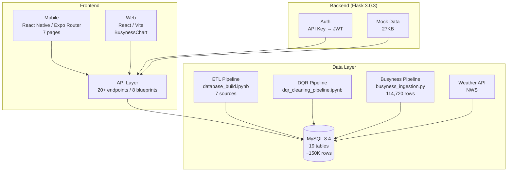

# ClearPath 项目状态

> 最后更新：2026-06-15 | openapi.yaml v1.5.0 | Sprint 2 进行中

---

## 一、项目架构

### 基本信息

| 项目 | 详情 |
|------|------|
| 项目名称 | ClearPath — Manhattan Accessibility Navigation |
| 技术栈 | Flask 3.0.3 + MySQL 8.4 + React Native (Expo) + React (Vite) |
| 分支 | `main` (production), `alex` (development) |
| 数据库 | MySQL `clearpath`, 19 tables, ~150K rows |
| 团队 | Hsu Ching Yun (H), fangxun.wu (F), David Irving (D), Joanna Saheed (J), Casey Liew (C), Emmett (E) |

### 系统架构



### 数据库连接

| 参数 | 值 |
|------|-----|
| Host | 127.0.0.1:3306 |
| User | clearpath_app |
| Password | clearpath_app |
| Database | clearpath |

---

## 二、已实现功能

### 数据库 Schema (19 tables)

| Table | Rows | 用途 | 状态 |
|-------|------|------|------|
| `venues` | 4,838 | 统一 POI 表 (24 cols) | ✅ |
| `venue_source_links` | 4,838 | 数据源追踪 | ✅ |
| `restroom_profiles` | 473 | 卫生间详情 | ✅ |
| `healthcare_profiles` | 1,086 | 医疗设施详情 | ✅ |
| `emergency_assets` | 3,279 | AED 设备 | ✅ |
| `pedestrian_ramps` | 23,625 | 无障碍坡道 | ✅ |
| `busyness_scores` | 114,720 | 拥挤度分数 (4,780 venues × 24h) | ✅ |
| `venue_language` | 63 | 多语言支持 (LASS) | ✅ |
| `report_categories` | 8 | 报告类别字典 | ✅ |
| `external_context_cache` | 1 | 天气 API 缓存 | ✅ |
| `users` | 0 | 账户系统 | ✅ Schema |
| `user_favorite_venues` | 0 | 收藏同步 | ✅ Schema |
| `notification_preferences` | 0 | 通知设置 | ✅ Schema |
| `busyness_forecasts` | 0 | 12h 预测 (待 ML 填充) | ✅ Schema |
| `venue_embeddings` | 0 | RAG 向量存储 | ✅ Schema |
| `user_reports` | 0 | 用户报告 | ✅ Schema |
| `report_confirmations` | 0 | 报告确认 | ✅ Schema |
| `venue_accessibility` | 0 | 无障碍详情 | ✅ Schema |
| `venue_warnings` | 0 | 场馆警告 | ✅ Schema |

### ETL 数据管道

| 数据源 | Manhattan 原始 | ETL 后 | 状态 |
|--------|--------------|--------|------|
| NYC Public Restrooms | 358 | 349 | ✅ |
| Parks Toilets | 129 | 127 | ✅ |
| OSM Healthcare | 900 | 655 | ✅ |
| NYS Health | 454 | 431 | ✅ |
| AED Inventory | 3,393 | 3,279 | ✅ |
| Pedestrian Ramps | 23,625 | 23,625 | ✅ |
| Weather (NWS API) | — | 1 cached | ✅ |
| Venue Language (LASS) | 442 | 63 | ✅ |

### Busyness 管道

| 组件 | 文件 | 状态 |
|------|------|------|
| ETL 管道 | `6.15-5.20/src/busyness_ingestion.py` | ✅ 44 tests passed |
| NYC Traffic 客户端 | `6.8-6.12_DB/dqr/dqr_utils.py` | ✅ |
| 数据库写入 | busyness_scores 114,720 行 | ✅ |
| Flask API 端点 | `src/api/venues.py` (busyness + forecast) | ⚠️ Mock |
| BestTime API | `src/settings.py` 配置 | ✅ 配置 / ❌ 未导入 |

### Venue Coverage 空间覆盖测试

| 组件 | 文件 | 状态 |
|------|------|------|
| 核心库 | `6.15-5.20/src/venue_coverage.py` (1,190行) | ✅ |
| CLI 入口 | `6.15-5.20/src/run_venue_coverage.py` | ✅ |
| 离线测试 | `6.15-5.20/tests/test_venue_coverage.py` (62 passed) | ✅ |
| MTA 数据源 | `5f5g-n3cz` (站点综合体) | ✅ |
| Citi Bike 覆盖率 | 45.3% @ 100m, 98.5% @ 500m | ✅ |

### DQR 数据质量

| 组件 | 文件 | 状态 |
|------|------|------|
| DQR Notebook | `6.8-6.12_DB/dqr_cleaning_pipeline.ipynb` (21 cells) | ✅ |
| 共享模块 | `6.8-6.12_DB/dqr/` (6 modules, 1,141 lines) | ✅ |
| DQR 测试 | `test_dqr_modules.py` (12 pytest cases) | ✅ |
| DQ 评分 | 96.3/100 (Excellent) | ✅ |

### 后端 API

| 模块 | 端点 | 合约 | 后端 |
|------|------|------|------|
| Health | `GET /health` | ✅ | ✅ |
| Venues | `GET /venues`, `GET /venues/{id}` | ✅ | ✅ Mock |
| Busyness | `GET /venues/{id}/busyness`, `/busyness/forecast` | ✅ | ⚠️ Mock |
| Reports | `GET/POST /reports` | ✅ | ⚠️ Mock |
| Insights | `GET /insights` | ✅ | ✅ Mock |
| Routes | `GET /routes` | ✅ | ✅ Mock |
| Chatbot | `POST /chatbot` | ✅ | ❌ RAG 未实现 |
| User | profile, settings, etc. | ✅ | ❌ Not wired |

### 前端

| 平台 | 页面/组件 | 状态 |
|------|----------|------|
| Mobile (Expo Router) | 7 pages: layout, language, location, legal, auth, login, settings | ✅ |
| Web (React + Vite) | App, BusynessChart, Mock Reports/Venues | ✅ |

---

## 三、待实现功能

### Sprint 2 进行中

| 任务 | 负责人 | 依赖 | 状态 |
|------|--------|------|------|
| D2.5 12h ML 预测 (ARIMA/LSTM) | F | busyness_forecasts ✅ | ⚠️ 主要阻塞 |
| D2.4 Mock 数据扩展 | F | — | 部分完成 |
| B2.3 后端集成 | E | D2.5 | 未开始 |

### 待实现

| 功能 | 优先级 | 说明 |
|------|--------|------|
| BestTime API 实时遥测导入 | P1 | 替换 district 级别 mock 为 venue 级别实时数据 |
| ML 训练 → busyness_forecasts | P1 | ARIMA/LSTM 预测 12h 连续数值 |
| JWT Auth 后端实现 | P2 | users 表已就绪 |
| RAG Chatbot | P2 | venue_embeddings 表已就绪 |
| Real-time telemetry pipeline | P2 | SSE map-updates |
| User Profile CRUD | P3 | 后端未接线 |

### 数据流缺口

```
BestTime API ──❌──→ busyness_scores ──❌──→ ML 训练 ──❌──→ busyness_forecasts
NYC Traffic  ──✅──→ busyness_scores (114,720 rows)
```

---

## 四、时间线

### 2026-06-15

- busyness_ingestion 5 个旧接口测试修复 (cursor.execute → executemany)
- Venue Coverage MTA 数据源替换 (y2qv-fytt → 5f5g-n3cz)
- 文件整理至 `6.15-5.20/` 目录
- CI 扩展：离线测试 + workflow_dispatch 集成测试
- Notebook Part 8 更新 (数据规模说明、多色预测曲线、forecast 展开)
- **关键数据**: 106 tests passed, 114,720 busyness rows, MTA `5f5g-n3cz`

### 2026-06-11

- DQR Notebook 拆分 (40→21 cells + 6 shared modules)
- GPS 网格修复 (经度 cos 缩放)
- D2.7 pytest — 12 个测试用例
- Park Toilet GPS — 124 零坐标 venues 修复, 473 restrooms 100% GPS
- Sprint 2 Data 任务审计: D2.1-D2.4 ✅, D2.6 ✅, D2.7 ✅

### 2026-06-10

- DQR Pipeline 4 处缺口修复
- database_build.ipynb cell 14/46 执行顺序 bug 修复
- venues 行数差异分析 (3,479 文档错误 → 实际 4,841)
- Data+ML 冗余文件清理

### 2026-06-09

- 19-table Schema 完成 (venue_type 统一为 emergencyasset)
- OpenAPI v1.5.0 合约 (20+ endpoints)
- users + favorites + notifications 表创建
- 10 项产品决策冻结 (D1-D10)
- busyness_forecasts + venue_embeddings 表创建

### 2026-06-08

- Flask blueprints + mock endpoints
- Mobile Expo Router 7 pages

### 2026-06-05

- ETL 数据导入 (7 sources, ~30K rows)
- Weather API 集成 (NWS)
- Venue Language ETL (LASS, 63 rows)

---

## 五、文件结构

```
docs/memory/                    ← 项目文档
├── project-status.md           ← 本文件
├── project-issues.md           ← 问题追踪 (P0/P1/P2)
├── execution-plan.md           ← 执行计划
├── context-terms.md            ← 术语表 + 决策记录
├── busynessreview.md           ← Busyness 实现进展
└── MEMORY.md                   ← 索引

src/                            ← Flask API
├── app.py, auth.py, main.py, settings.py, mock_data.py
└── api/                        ← 8 blueprints

frontend/mobile/                ← React Native (Expo Router, 7 pages)
frontend/web/                   ← React (Vite, BusynessChart)

Data+ML/test/
├── 6.2-6.5_DB/                 ← ETL pipeline (database_build.ipynb)
├── 6.8-6.12_DB/                ← DQR pipeline + dqr 共享模块
├── 6.15-5.20/                  ← Busyness + Venue Coverage (本迭代)
│   ├── src/                    ← busyness_ingestion.py, venue_coverage.py
│   ├── tests/                  ← 106 tests (44 busyness + 62 coverage)
│   ├── output/                 ← 运行输出
│   └── docs/                   ← SOP + 审查文档
└── shared/                     ← 6 共享 Python 模块

docker/mysql/init/              ← Docker init schema
.github/workflows/              ← CI (data_ci.yml, backend_ci.yml, frontend_ci.yml)
```
