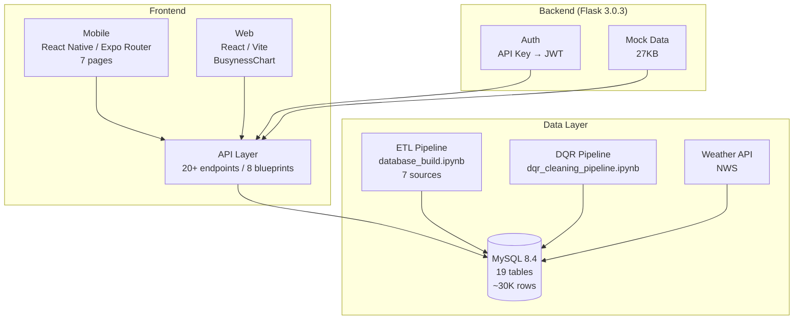

# ClearPath Current Project Status

> Updated: 2026-06-10 | openapi.yaml v1.5.0 | grill-with-docs decisions frozen
> Sprint 2 进行中 | Notion: 仅 D2.1 (ERD) In progress

---

## Project Overview

- **Project Name**: ClearPath — Manhattan Accessibility Navigation
- **Tech Stack**: Flask + MySQL + React Native (Expo) + React (Vite)
- **Branches**: `main` (production), `alex` (development)
- **DB**: MySQL `clearpath` schema, 19 tables
- **Team**: Hsu Ching Yun (H), fangxun.wu (F), David Irving (D), Joanna Saheed (J), Casey Liew (C), Emmett (E)

## Architecture Overview



## Database Connection

| Parameter | Value |
|-----------|-------|
| Host | 127.0.0.1:3306 |
| User | clearpath_app |
| Password | clearpath_app |
| Database | clearpath |

---

## Database Schema Status (19 tables)

### Completed Tables

| Table | Rows | Purpose |
|-------|------|---------|
| `venues` | ~3,479 | Unified POI table (24 cols: district, language, accessibility, warnings, weather_risk) |
| `venue_source_links` | ~3,479 | Data source tracking (1:1 with venues) |
| `restroom_profiles` | 476 | Restroom details |
| `healthcare_profiles` | 1,228 | Healthcare facility details |
| `emergency_assets` | ~3,279 | AED devices (unique constraint on venue_id, floor, location_type) |
| `pedestrian_ramps` | 23,625 | Accessibility ramps (with district zoning) |
| `venue_accessibility` | 0 | Venue accessibility details (pending) |
| `venue_language` | 63 | Venue multilingual support (LASS data) |
| `venue_warnings` | 0 | Venue warnings (pending runtime) |
| `external_context_cache` | 1 | Weather API cache (NWS) |
| `users` | 0 | Account system (D1: email + password, D7: no auth_subject) |
| `user_favorite_venues` | 0 | Cross-device favorite sync |
| `notification_preferences` | 0 | Quiet hours + Push subscriptions |
| `report_categories` | 8 | Report category dictionary (D8: filter by venue type) |
| `busyness_forecasts` | 0 | 12-hour time-series forecast (D4: quiet/moderate/busy) |
| `venue_embeddings` | 0 | RAG vector storage (D9: MySQL JSON) |

### Modified Tables

| Table | Modification | Status |
|-------|-------------|--------|
| `user_reports` | Added `user_id` FK, DROP `reported_by`, `issue_type` → VARCHAR + FK | ✅ 2026-06-09 |
| `report_confirmations` | Added `user_id` FK + `UNIQUE (report_id, user_id)` | ✅ 2026-06-09 |
| `busyness_scores` | ENUM changed to `quiet/moderate/busy/no_data`, nullable, forecast_1h → JSON | ✅ 2026-06-09 |

### venue_type ENUM (2026-06-10 统一)

```sql
ENUM('restroom', 'healthcare', 'emergencyasset', 'clinic', 'pharmacy', 'hospital', 'dentist', 'laboratory')
```
> 注: OpenAPI、DB Schema、ETL notebook 已统一为 `emergencyasset`（无下划线）

---

## venues Table Columns: 24

```
venue_id, venue_type, name, latitude, longitude, borough, district,
language_tags, primary_language, secondary_language, accessible_status,
accessibility_features, active_warning, open_now, address, phone, website,
opening_hours, photos, rating, weather_risk, source_confidence,
created_at, updated_at
```

> 注: Data+ML schema 的 venues 表包含 `district` 列，但 Docker schema 尚未同步。详见 `project-issues.md #4`。

---

## ETL Pipeline Status

- **Notebook**: `Data+ML/test/6.2-6.5_DB/database_build.ipynb`
- **Schema**: `Data+ML/test/6.2-6.5_DB/001_clearpath_schema.sql`
- **Docker Schema**: `docker/mysql/init/001_clearpath_schema.sql`
- **Data Sources**: `data_source/` (outside repo), managed by `clearpath_sources.json`
- **MySQL Docker**: `docker-compose.yml` at repo root
- **District Zoning**: ✅ Implemented (venues + pedestrian_ramps)
- **Weather API**: ✅ NWS integration, 1 cached entry
- **Venue Language**: ✅ LASS data, 63 matched
- **DQR Pipeline**: `Data+ML/test/6.8-6.12_DB/dqr_cleaning_pipeline.ipynb` (数据质量报告, 4 gaps fixed 2026-06-10)
- **Notebook Cell Safety**: Cells 27/31/35/37/46 已注释（已完成或危险操作），cell 14 添加 `finally` 连接清理

### ETL Row Counts (2026-06-10, corrected)

| Data Source | Manhattan | After ETL |
|-------------|-----------|-----------|
| NYC Public Restrooms | 358 | 349 imported |
| Parks Toilets | 129 | 127 imported |
| OSM Healthcare | 900 | 655 imported (↓142 vs plan) |
| NYS Health | 454 | 431 imported |
| AED Inventory | 3,393 | 3,279 imported (dedup) |
| Pedestrian Ramps | 23,625 | 23,625 imported |
| Weather (NWS API) | — | 1 cached |
| Venue Language (LASS) | 442 | 63 matched |

> 注: 旧版记录的 3,479 venues 是文档计算错误（应为 4,983）。实际 DB 行数为 4,841（OSM Healthcare 少 142 条）。 `[ses_14a4f112bfferlcsOw1C094HjM]`

---

## OpenAPI Status (v1.5.0) — Contract ready, backend pending

- **Endpoints**: 20+
- **Tags**: Health, User, Venues, Busyness, Reports, Insights, Chatbot, Routes, Realtime
- **Coverage**: ~90%
- **Gap Analysis**: `docs/memory/openapi_gap_finalacceptcriteria.md`

### OpenAPI Contract Status

| Module | Endpoints | Contract | Backend |
|--------|-----------|----------|---------|
| Health | `GET /health` | ✅ | ✅ |
| Venues | `GET /venues`, `GET /venues/{id}` | ✅ | ✅ Mock |
| Busyness | `GET /venues/{id}/busyness`, `GET /venues/{id}/busyness/forecast` | ✅ | ❌ Table ready, no data |
| Reports | `GET/POST /reports`, `POST /reports/{id}/confirmations` | ✅ | ⚠️ Mock only |
| Insights | `GET /insights` | ✅ | ✅ Mock |
| Chatbot | `POST /chatbot` | ✅ | ❌ RAG not implemented |
| User | profile, settings, languages, favourites, SOS, notification-prefs, account delete, medical-passport | ✅ | ❌ Not wired |
| Routes | options, detail | ✅ | ✅ Mock |
| Realtime | SSE map-updates | ✅ | ✅ Mock |

---

## Frontend Status

### Mobile (React Native / Expo Router) — `frontend/mobile/`

| Page | File | Status |
|------|------|--------|
| Layout | `_layout.tsx` | ✅ |
| Language Selection | `index.tsx` | ✅ |
| Location Permission | `location.tsx` | ✅ |
| Legal & Compliance | `legal.tsx` | ✅ |
| Auth Gateway | `auth-gateway.tsx` | ✅ |
| Login/Register | `login.tsx` | ✅ |
| Settings | `settings.tsx` | ✅ |

**Components**: animated-icon, app-tabs, external-link, hint-row, themed-text, themed-view, collapsible, web-badge
**Services**: location.ts, medical.ts, profile.ts
**Data**: languages.ts, mockMedicalId.ts, mockProfile.ts
**Constants**: colours.ts, theme.ts, typography.ts

### Web (React + Vite) — `frontend/web/`

| Component | File | Status |
|-----------|------|--------|
| App | `App.jsx` | ✅ |
| Busyness Chart | `BusynessChart.jsx` | ✅ |
| Mock Reports | `data/reports.js` | ✅ |
| Mock Venues | `data/venues.js` | ✅ |

---

## Backend Status (Flask) — `src/`

| File | Purpose | Status |
|------|---------|--------|
| `app.py` | Flask app factory, blueprint registration | ✅ |
| `auth.py` | API key middleware | ✅ |
| `main.py` | Entry point | ✅ |
| `settings.py` | Config | ✅ |
| `mock_data.py` | Mock data (27KB, reports, venues, user) | ✅ |
| `api/health.py` | Health check endpoint | ✅ |
| `api/venues.py` | Venue list & detail | ✅ |
| `api/reports.py` | Report CRUD + confirmations | ⚠️ Mock only |
| `api/insights.py` | Dashboard metrics | ✅ |
| `api/routes.py` | Navigation routes | ✅ |
| `api/user.py` | Profile, settings | ❌ Not wired |
| `api/integrations.py` | External integrations | ✅ |
| `api/app_state.py` | App state management | ✅ |

> `pyproject.toml`: Poetry, Python 3.11+, Flask 3.0.3, python-dotenv

---

## Sprint Pipeline Status

### 已完成

| 项目 | 状态 |
|------|------|
| ✅ 19-table Schema (venue_type 统一为 emergencyasset) | 2026-06-10 |
| ✅ ETL data ingestion (7 sources, ~30K rows) | 2026-06-05 |
| ✅ Mock data (v1.5.0) | 2026-06-09 |
| ✅ Weather API integration (NWS) | 2026-06-05 |
| ✅ Venue Language ETL (LASS, 63 rows) | 2026-06-05 |
| ✅ District Zoning (venues + pedestrian_ramps) | 2026-06-09 |
| ✅ emergency_assets unique constraint | 2026-06-06 |
| ✅ OpenAPI v1.5.0 contract (20+ endpoints) | 2026-06-09 |
| ✅ users + favorites + notifications tables | 2026-06-09 |
| ✅ report_categories + ALTER user_reports/confirmations | 2026-06-09 |
| ✅ busyness_forecasts + venue_embeddings tables | 2026-06-09 |
| ✅ 10 产品决策冻结 (D1-D10) | 2026-06-09 |
| ✅ DQR 数据质量报告 | 2026-06-10 |
| ✅ Notion Sprint Backlog 导出 + 对齐 | 2026-06-10 |
| ✅ Flask blueprints + mock endpoints | 2026-06-08 |
| ✅ Mobile Expo Router (7 pages) | 2026-06-08 |
| ✅ Web Vite + React (BusynessChart) | 2026-06-10 |

### 进行中 (Sprint 2)

| 项目 | 负责人 | Notion 状态 |
|------|--------|-------------|
| 🔄 ERD Revision & District Zoning Setup | F | **In progress** |

### 待实现功能 (Sprint 2)

| 项目 | 负责人 | 依赖 |
|------|--------|------|
| ❌ JWT Auth (backend impl) | E | users table ✅ |
| ❌ Profile CRUD (backend impl) | E | users table ✅ |
| ❌ Mobile UI Component Binding | D | Mock data ✅ |
| ❌ Web UI Component Binding | C | Mock data ✅ |
| ❌ Real-time telemetry pipeline | F | — |
| ❌ 12-hour ML forecast (table ready) | F | busyness_forecasts ✅ |
| ❌ Report TTL (2h) | E | — |
| ❌ Cascade delete API | E | users table ✅ |
| ❌ Gemini RAG (table ready) | E | venue_embeddings ✅ |

### 已知问题

> 所有技术问题、阻塞项、已解决问题详见 [`project-issues.md`](project-issues.md)。
> 当前未解决: P0 × 2 (#4 district schema, #5 ImportError) · P1 × 2 (#11 expires_at, #12 KeyError) · P2 × 2 (#16 DQR O(N²), #17 dqr_utils 重复)

---

## File Structure

```
docs/memory/
├── project-status.md          ← This file
├── project-issues.md          ← Current issues (评审验证后)
├── execution-plan.md          ← Execution plan (DB schema focus)
├── context-terms.md           ← Domain glossary + 10 frozen decisions (D1-D10)
├── openapi_gap_finalacceptcriteria.md  ← Gap analysis
├── sprint-tasks-1-4.md        ← Sprint 1-4 task summary (Notion 对齐)
├── notion-sprint-backlog-export.md ← Notion 数据导出 (2026-06-10)
├── clearpath-requirements-features.md ← Requirements
└── MEMORY.md                  ← Index

src/                           ← Flask API prototype
├── app.py                     # App factory + blueprint registration
├── auth.py                    # API key middleware
├── main.py                    # Entry point
├── settings.py                # Config
├── mock_data.py               # Mock data (27KB)
└── api/
    ├── health.py              # GET /health
    ├── venues.py              # GET /venues, GET /venues/{id}
    ├── reports.py             # POST /reports, POST /reports/{id}/confirmations
    ├── insights.py            # GET /insights
    ├── routes.py              # GET /routes
    ├── user.py                # GET /user/profile (⚠️ ImportError)
    ├── integrations.py        # External integrations
    └── app_state.py           # App state

frontend/mobile/               ← React Native (Expo Router)
├── src/app/                   # Pages: index, location, legal, auth-gateway, login, settings
├── src/components/            # UI components (animated-icon, app-tabs, etc.)
├── src/services/              # location, medical, profile
├── src/data/                  # languages, mockMedicalId, mockProfile
├── src/constants/             # colours, theme, typography
└── package.json               # Expo + React Native

frontend/web/                  ← React (Vite)
├── src/App.jsx                # Main app
├── src/components/            # BusynessChart.jsx
├── src/data/                  # reports.js, venues.js
└── package.json               # Vite + React

Data+ML/
├── test/6.2-6.5_DB/
│   ├── database_build.ipynb   # ETL pipeline (49 cells)
│   ├── 001_clearpath_schema.sql  # DB schema
│   ├── dqr_utils.py           # DQR utility functions
│   ├── clearpath_sources.json # Data source manifest
│   └── README.md              # Operating instructions
├── test/6.8-6.12_DB/
│   ├── dqr_cleaning_pipeline.ipynb  # DQR pipeline
│   ├── dqr_utils.py           # (duplicate of 6.2-6.5_DB)
│   └── *.csv, *.png           # DQR outputs
└── plan/                      # Architecture docs

docker/
└── mysql/init/
    └── 001_clearpath_schema.sql  # Docker init schema

pyproject.toml                 # Poetry: Python 3.11+, Flask 3.0.3
docker-compose.yml             # MySQL 8.4 + phpMyAdmin
openapi.yaml                   # API contract v1.5.0
```
